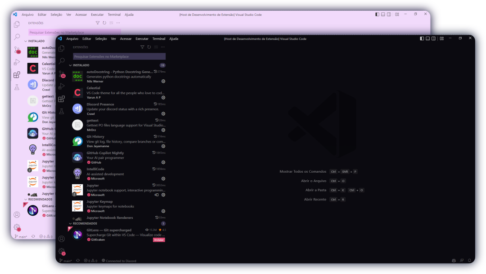

<!-- markdownlint-configure-file {
  "MD013": {
    "code_blocks": false,
    "tables": false
  },
  "MD033": false,
  "MD041": false
} -->

<table>
<tbody>
<tr>
<td>

## BlackBerry VSCode Theme

A beautiful clean theme for VSCode [Forked from Horizon theme](https://github.com/jolaleye/horizon-theme-vscode/) 🎉

</td>
</tr>
</tbody>
</table>
 

## Installation

1. Open the Extensions sidebar in VS Code
2. Search for `BlackBerry Theme`
3. Click `Install`
4. Open the Command Palette with `Ctrl+Shift+P` or `⇧⌘P`
5. Select Color Theme and enjoy! 🎉

## License

[MIT](LICENSE)

